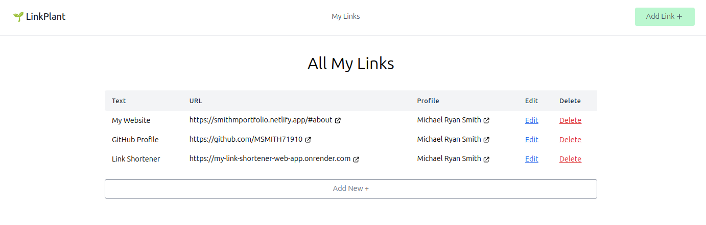

# 🌱 LinkPlant

LinkPlant is a web application built with Django and HTML that allows users to manage and organize their links efficiently. This Python-based project provides a simple and intuitive interface for creating, updating, deleting, and viewing links. Users can also view links grouped by profiles with customizable background colors.

## Features

- **Link Management**: Add, edit, and delete links with ease.
- **Profile-Based Organization**: Group links under profiles with customizable background colors.
- **Responsive Design**: Built with Tailwind CSS for a modern and responsive user interface.
- **CRUD Operations**: Full support for Create, Read, Update, and Delete operations for links.

## Screenshots

Here are some snapshots of the application:

### Main Edit Page

### Profile Clint View

